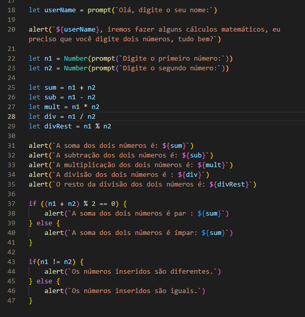

# Desafio Stage 4 Rocketseat 

> Trilha Explorer

Finalizei o penúltimo desafio de lógica de programação e algoritmos do stage 4 da trilha Explorer da Rocketseat. 

O que foi abordado nesse desafio:
- Variáveis;
- Operações matemáticas;
- Operadores comparativos;
- Condicional.

O desafio consistia no seguinte : Solicitar ao usuário que ele insira dois números e, a partir daí, calcular:

-  A soma dos dois números;
-  A subtração dos dois números;
-  A multiplicação dos dois números;
-  A divisão dos dois números;
-  O resto da divisão dos dois números; 

-  Verifique se a soma dos dois números é par (ou ímpar);
-  Verifique se os dois números inseridos são iguais (ou diferentes).

Lembre-se de sempre mostrar na tela o resultado de cada uma dessas operações!

[🔗 Clique aqui para acessar](https://filipesantos07.github.io/Explorer-Stage-4-penultimo-desafio/)

## 🛠️ Tecnologias

- HTML
- JavaScript

## 💛 Contato

FilipeSantosEstudos1@gmail.com
